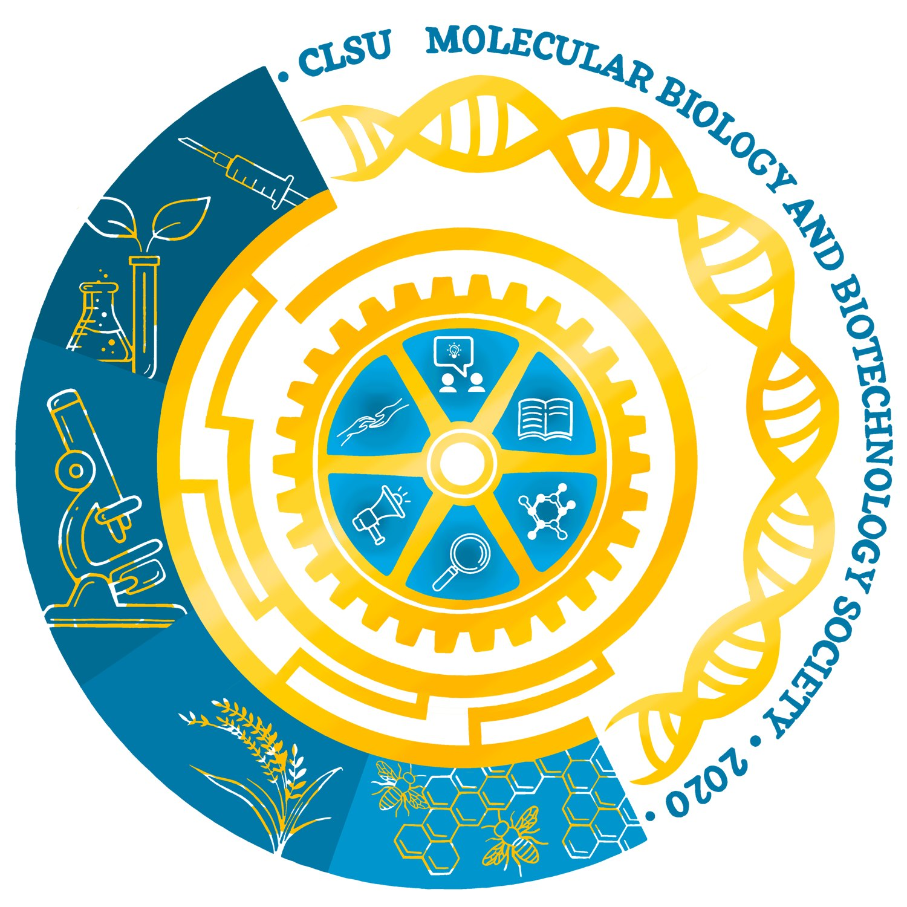

# Central Luzon State University Molecular Biology and Biotechnology Society

  

The Central Luzon State University Molecular Biology and Biotechnology Society (CLSU MBBSoc) aims to promote and create public awareness of the science of Molecular Biology, Biotechnology, and allied fields in the Philippines.

# Vision

Become the primary organization to annotate, enhance, and express the university's capacity in research and development relevant to the country's advancement through Molecular Biology and Biotechnology applications that break into promotion, education, and public service. In its prolonged period of establishment, the organization can now look forward to replicating breakthroughs in the science community, transcribing modern technological trends, and translating knowledge to the Filipino people for the country's evolving needs toward sustainable development.
